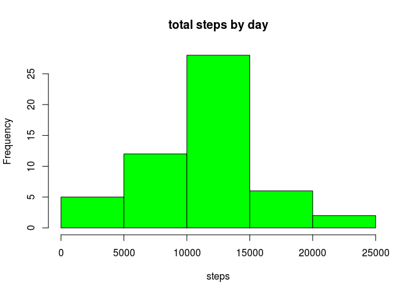
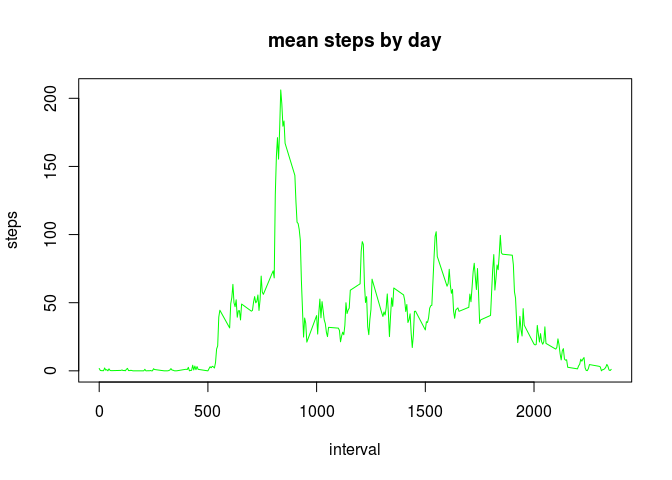

# Reproducible Research: Peer Assessment 1


## Loading and preprocessing the data
**1.unzip and loading data**

**2.making data$date to format class Date**


```r
# unzip and loading data
unzip("activity.zip")
data<-read.csv("activity.csv")
#for seeing
head(data)
```

```
##   steps       date interval
## 1    NA 2012-10-01        0
## 2    NA 2012-10-01        5
## 3    NA 2012-10-01       10
## 4    NA 2012-10-01       15
## 5    NA 2012-10-01       20
## 6    NA 2012-10-01       25
```

```r
#and it's structure
str(data)
```

```
## 'data.frame':	17568 obs. of  3 variables:
##  $ steps   : int  NA NA NA NA NA NA NA NA NA NA ...
##  $ date    : Factor w/ 61 levels "2012-10-01","2012-10-02",..: 1 1 1 1 1 1 1 1 1 1 ...
##  $ interval: int  0 5 10 15 20 25 30 35 40 45 ...
```

```r
#preprocessing data

 
data$date<-as.Date(data$date)

#finally it's structure
str(data)
```

```
## 'data.frame':	17568 obs. of  3 variables:
##  $ steps   : int  NA NA NA NA NA NA NA NA NA NA ...
##  $ date    : Date, format: "2012-10-01" "2012-10-01" ...
##  $ interval: int  0 5 10 15 20 25 30 35 40 45 ...
```
## What is mean total number of steps taken per day?


```r
total_steps<-aggregate(steps~date,data,sum)
#seeing mean_steps
print(total_steps)
```

```
##          date steps
## 1  2012-10-02   126
## 2  2012-10-03 11352
## 3  2012-10-04 12116
## 4  2012-10-05 13294
## 5  2012-10-06 15420
## 6  2012-10-07 11015
## 7  2012-10-09 12811
## 8  2012-10-10  9900
## 9  2012-10-11 10304
## 10 2012-10-12 17382
## 11 2012-10-13 12426
## 12 2012-10-14 15098
## 13 2012-10-15 10139
## 14 2012-10-16 15084
## 15 2012-10-17 13452
## 16 2012-10-18 10056
## 17 2012-10-19 11829
## 18 2012-10-20 10395
## 19 2012-10-21  8821
## 20 2012-10-22 13460
## 21 2012-10-23  8918
## 22 2012-10-24  8355
## 23 2012-10-25  2492
## 24 2012-10-26  6778
## 25 2012-10-27 10119
## 26 2012-10-28 11458
## 27 2012-10-29  5018
## 28 2012-10-30  9819
## 29 2012-10-31 15414
## 30 2012-11-02 10600
## 31 2012-11-03 10571
## 32 2012-11-05 10439
## 33 2012-11-06  8334
## 34 2012-11-07 12883
## 35 2012-11-08  3219
## 36 2012-11-11 12608
## 37 2012-11-12 10765
## 38 2012-11-13  7336
## 39 2012-11-15    41
## 40 2012-11-16  5441
## 41 2012-11-17 14339
## 42 2012-11-18 15110
## 43 2012-11-19  8841
## 44 2012-11-20  4472
## 45 2012-11-21 12787
## 46 2012-11-22 20427
## 47 2012-11-23 21194
## 48 2012-11-24 14478
## 49 2012-11-25 11834
## 50 2012-11-26 11162
## 51 2012-11-27 13646
## 52 2012-11-28 10183
## 53 2012-11-29  7047
```

```r
#histogram
hist(total_steps$steps,col="green",xlab="steps",main="total steps by day")
```

 

```r
#it's mean
mean(total_steps$steps,na.rm=T)
```

```
## [1] 10766
```

```r
#or median
median(total_steps$steps,na.rm=T)
```

```
## [1] 10765
```

## What is the average daily activity pattern?


```r
mean_steps<-aggregate(steps~interval,data,mean)
#seeing head
head(mean_steps)
```

```
##   interval   steps
## 1        0 1.71698
## 2        5 0.33962
## 3       10 0.13208
## 4       15 0.15094
## 5       20 0.07547
## 6       25 2.09434
```

```r
#seeing tail
tail(mean_steps)
```

```
##     interval  steps
## 283     2330 2.6038
## 284     2335 4.6981
## 285     2340 3.3019
## 286     2345 0.6415
## 287     2350 0.2264
## 288     2355 1.0755
```

```r
#ploting
plot(mean_steps$steps~mean_steps$interval,type="l",col="green",xlab="interval",ylab="steps",main="mean steps by day")
```

 

```r
#2. Which 5-minute interval, on average across all the days in the #dataset, contains the maximum number
#of steps?
n_steps_max <- which.max(mean_steps$steps)
interval_of_max <- mean_steps$interval[n_steps_max]
interval_of_max
```

```
## [1] 835
```

## Imputing missing values

```r
#1. Calculate and report the total number of missing values in the #dataset (i.e. the total number of rows with
#NA s)
sum(!complete.cases(data))
```

```
## [1] 2304
```
## Are there differences in activity patterns between weekdays and  ?

```r
days <- weekdays(data$date)
data$day_type <- ifelse(days == "Samedi" | days == "Dimanche", 
                                "Weekend", "Weekday")
data$day_type<-as.factor(data$day_type)
week_data<-aggregate(interval~steps + day_type,data,mean)
head(week_data)
```

```
##   steps day_type interval
## 1     0  Weekday     1121
## 2     1  Weekday     1149
## 3     2  Weekday     1540
## 4     3  Weekday     1298
## 5     4  Weekday     1074
## 6     5  Weekday     1241
```
